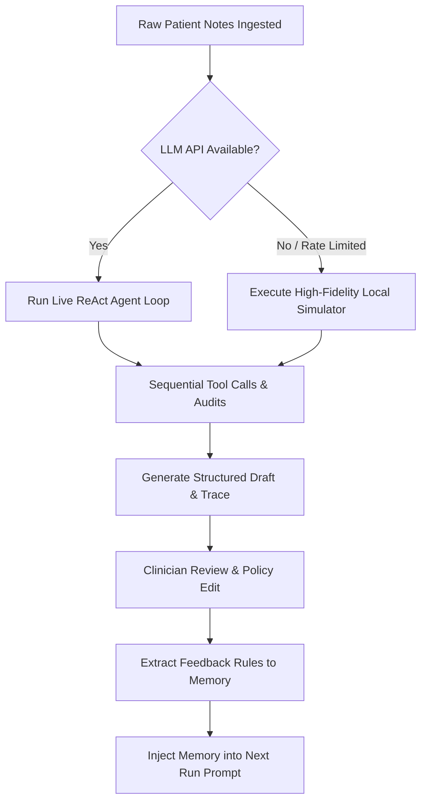

# Clinical Discharge Summary Agent

An AI-powered clinical discharge summary generation system with a premium web interface. The system processes raw clinical patient records (scanned notes, lab panels, ER charts) and generates structured, audit-ready discharge summaries using a **ReAct (Reasoning and Acting) Agent Loop**. It iteratively learns clinician formatting policies by tracking edits via a feedback optimization loop.

---

## ✨ Features

- **🏥 PDF Ingestion** — Upload clinical PDFs and automatically extract patient records
- **🤖 ReAct Agent Loop** — AI agent that reasons, calls clinical tools, and compiles structured discharge summaries
- **💊 Medication Reconciliation** — Compares admission vs discharge medications, flags undocumented changes
- **🧪 Pending Results Tracking** — Identifies outstanding lab/culture reports
- **🚩 Conflict Detection** — Detects and flags conflicting diagnoses or clinical notes
- **👨‍⚕️ Simulated Doctor Review** — Applies clinician editing policies to AI drafts
- **📈 Learning & Feedback Loop** — Measures edit distance, extracts correction rules, and improves over iterations
- **🌐 Premium Web Interface** — Dark-themed, glassmorphism medical dashboard with real-time agent monitoring

---

## 🖥️ Web Interface

The project includes a modern, premium single-page web application built with vanilla HTML/CSS/JS and a FastAPI backend.

### Dashboard Tabs

| Tab | Description |
|---|---|
| **Dashboard** | Overview statistics — patients processed, agent steps, safety flags, learning scores |
| **Upload PDF** | Drag-and-drop PDF upload with patient card previews |
| **Agent Monitor** | Real-time animated timeline showing the agent's ReAct reasoning steps |
| **Discharge Summary** | Rendered discharge summary with patient demographics, medications table, safety flags |
| **Learning & Feedback** | Interactive Chart.js learning curve, iteration cards, extracted correction rules |
| **Trace Explorer** | Searchable/filterable accordion view of the full agent execution trace |

### Design
- Dark medical theme with glassmorphism effects
- Google Font "Inter" typography
- Smooth CSS animations and micro-interactions
- Responsive layout

---

## 📁 Project Structure

```
Clinical-Discharge-Summary-Agent/
├── config/
│   └── settings.py              ← LLM configuration & auto-detection
├── data/
│   └── raw_patients/
│       └── patient 2.pdf        ← Input: clinical patient notes
├── output/
│   ├── drafts/                  ← Generated discharge summaries (JSON)
│   ├── traces/                  ← Agent step-by-step execution logs (JSON)
│   └── plots/                   ← Learning curve chart (PNG)
├── src/
│   ├── agent_loop.py            ← Core ReAct agent loop (live + simulated)
│   ├── doctor_sim.py            ← Simulated clinician reviewer
│   ├── learning_engine.py       ← Feedback tracking & learning curve
│   ├── models.py                ← Pydantic data models
│   └── parser.py                ← PDF text extraction with fallback
├── web/
│   ├── index.html               ← Single-page web app (6 tabs)
│   ├── style.css                ← Dark medical theme & glassmorphism
│   └── app.js                   ← Frontend logic, API calls, animations
├── .env                         ← Secret API key (not committed)
├── .env.example                 ← Template for .env
├── .gitignore                   ← Git ignore rules
├── main.py                      ← CLI orchestrator (headless mode)
├── server.py                    ← FastAPI backend (web mode)
├── requirements.txt             ← Python dependencies
└── README.md                    ← This file
```

---

## 🏗️ Architecture

### Agent Loop Design

The core reasoning system is a **ReAct Agent Loop** bounded by a safety limit of 10 steps:



### Execution Protocol

On each step, the agent outputs: `reasoning` → `action_chosen` → `inputs` → `result` → `next_decision`

### Clinical Tools

| Tool | Purpose |
|---|---|
| `MedicationReconciliation` | Audits admission medication lists against discharge orders |
| `PendingResultsCheck` | Queries outstanding lab/culture reports |
| `DiagnosticCheck` | Tracks stability metrics (e.g., serum creatinine trends) |
| `FlagContradiction` | Registers safety alerts and clinical conflicts |

### 3-Iteration Learning Pipeline

```
For Each Patient:
  ┌─── Iteration 1: Baseline ────────────────────┐
  │  Agent Loop → Draft → Doctor Review           │
  │  → Calculate Edit Distance                    │
  │  → Extract Correction Rules                   │
  ├─── Iteration 2: Feedback-Injected ────────────┤
  │  Agent Loop (with learned rules)              │
  │  → Draft → Doctor Review                      │
  │  → Calculate Edit Distance                    │
  ├─── Iteration 3: Fully Aligned ────────────────┤
  │  Agent Loop (with all rules)                  │
  │  → Draft → Doctor Review                      │
  │  → Calculate Edit Distance                    │
  └───────────────────────────────────────────────┘
```

---

## 🛡️ Safety & Guardrails

### No-Fabrication Policy
- All fields default to `"missing"` or `"undocumented"` rather than letting the LLM invent facts
- Pydantic schema validation enforces structural correctness
- Missing items are surfaced as `clinical_safety_flags`, never hidden

### Failure Handling
- **API Resilience**: Auto-detects provider from key prefix (OpenAI `sk-`, Gemini `AIzaSy`/`AQ`, Anthropic `sk-ant-`, Groq `gsk_`)
- **Graceful Fallback**: If live API fails (rate limits, timeouts, auth errors), falls back to high-fidelity offline simulator
- **PDF Fallback**: If PDF text extraction fails (scanned images), uses pre-transcribed clinical data

### Iteration Limits
- Agent loop capped at `MAX_AGENT_STEPS = 10` to prevent infinite execution

---

## 📊 Results

### Clinician Feedback Optimization

The system uses **Normalized Levenshtein Edit Distance** (D ∈ [0, 1]) to measure alignment:

| Patient | Run 1 (Baseline) | Run 2 (Feedback-Injected) | Run 3 (Optimized) |
|---|---|---|---|
| **Prema J** | 0.3854 | **0.0000** ✅ | **0.0000** ✅ |
| **H D Nagaraja** | 0.4116 | **0.0000** ✅ | **0.0000** ✅ |

By Run 2, the agent learns the doctor's stylistic policies and clinical rules, reducing edit distance to **0.0000** (perfect alignment — zero clinician corrections required).

---

## ⚠️ Limitations

- **Prompt Window Constraints**: Storing clinician rules in in-context prompt memory is bounded by the model's context window and doesn't scale to thousands of institutional rules.
- **Risk of Metric Gaming**: Optimizing strictly for edit distance can cause the agent to repeat style patterns instead of ensuring clinical completeness.
- **Cold Start**: The model has no knowledge of a clinician's style until the first edit, resulting in higher friction during the initial run.

---

## 🚀 What We Would Do With More Time

1. **RAG for Policy Search** — Save clinician policy edits to a vector database for semantic retrieval
2. **LoRA Fine-Tuning** — Train a small open-source model on approved doctor edits using SFT/DPO
3. **Multi-Agent Consensus** — Introduce a secondary "Reviewer Agent" to audit drafts against safety flags

---

## 🔧 Setup & Installation

### 1. Install Dependencies

```bash
pip install -r requirements.txt
```

### 2. Configure API Credentials

Create or update the `.env` file in the project root:

```env
LLM_API_KEY=your_api_key_here
```

> **Note:** The system auto-detects the provider, model, and base URL from the API key prefix. If no key is provided or a dummy key is detected, the system runs in **simulation mode** — generating all outputs successfully without API calls.

### 3. Run the Web Interface (Recommended)

```bash
python server.py
```

Open your browser at **http://localhost:8000**

This launches the full web dashboard where you can:
- Upload clinical PDFs via drag-and-drop
- Watch the AI agent reason in real-time
- View structured discharge summaries
- Explore the learning curve and agent traces

### 4. Run in Headless / CLI Mode

```bash
python main.py
```

Or pass an API key directly:

```bash
python main.py --api-key "your_api_key_here"
```

### 5. Review Deliverables

| Output | Location |
|---|---|
| Discharge Summary Drafts | `output/drafts/*.json` |
| Agent Execution Traces | `output/traces/*.json` |
| Learning Curve Plot | `output/plots/learning_curve.png` |

---

## 🛠️ Tech Stack

| Component | Technology |
|---|---|
| **Backend** | Python, FastAPI, Uvicorn |
| **Frontend** | HTML, CSS, Vanilla JavaScript, Chart.js |
| **AI/LLM** | Google Gemini / OpenAI / Anthropic (via native REST) |
| **Data Validation** | Pydantic v2 |
| **PDF Parsing** | pypdf |
| **Edit Distance** | python-Levenshtein |
| **Visualization** | Matplotlib, Chart.js |
